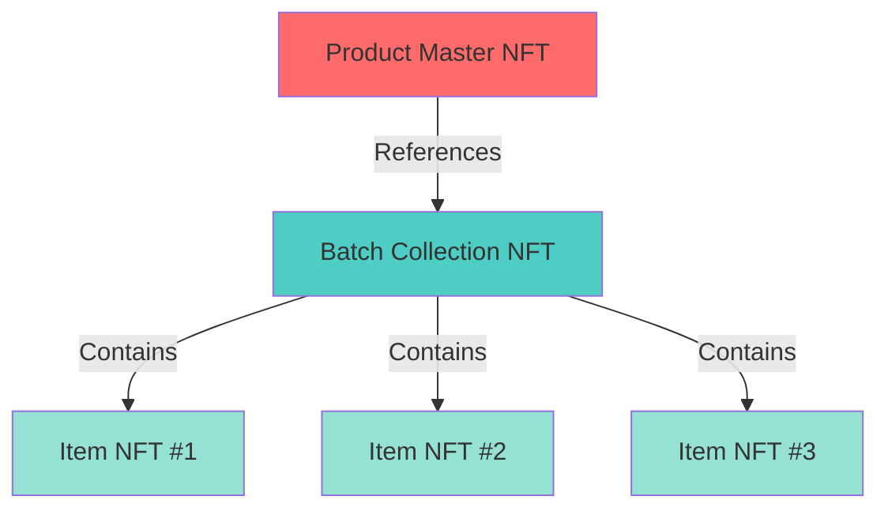

# 🚀 Quick Start: 3-Tier NFT Hierarchy

## Complete NFT Structure

```
📦 Product Master NFT (GTIN: 8901234567890)
   ├─ Company: TechCorp Industries
   ├─ Category: Electronics
   └─ NFT Address: Stored in Product table
      │
      ├── 📦 Batch Collection NFT (Batch: 2025-Q1-A)
      │   ├─ References: Product NFT
      │   ├─ Manufacturing: Factory-A, Line-1
      │   ├─ Planned: 1000 units
      │   └─ NFT Collection Address: Stored in Batch table
      │      │
      │      ├── 🎫 Item NFT #00001
      │      │   ├─ Serial: PROD-2025-Q1A-00001
      │      │   ├─ In Collection: Batch NFT
      │      │   └─ References: Product NFT
      │      │
      │      ├── 🎫 Item NFT #00002
      │      └── 🎫 Item NFT #00003
```

---

## 🎯 Quick Commands

### 1️⃣ Create Product (Database Only)
```bash
curl -X POST http://localhost:3000/api/products \
  -H "Content-Type: application/json" \
  -d '{
    "gtin": "8901234567890",
    "productName": "Model-X Pro",
    "company": "TechCorp Industries",
    "category": "Electronics",
    "model": "MXP-2025",
    "warrantyMonths": 24,
    "imageUrl": "https://example.com/image.jpg"
  }'
```

### 2️⃣ Create Product Master NFT (Blockchain)
```bash
curl -X POST http://localhost:3000/api/products/8901234567890/nft
```

**This creates:**
- ✅ NFT on Solana
- ✅ Metadata on Arweave
- ✅ Updates product with NFT address

### 3️⃣ Create Batch with Collection NFT
```bash
curl -X POST http://localhost:3000/api/batches \
  -H "Content-Type: application/json" \
  -d '{
    "productId": 1,
    "batchName": "2025-Q1-A",
    "manufacturingFacility": "Factory-A, Mumbai",
    "productionLine": "Line-1",
    "startDate": "2025-01-15",
    "plannedQuantity": 1000
  }'
```

**This creates:**
- ✅ Batch Collection NFT on Solana
- ✅ References Product Master NFT
- ✅ Batch record with NFT addresses

**Response includes:**
```json
{
  "blockchain": {
    "productNft": "7xK...xyz",              // ← Product Master NFT
    "productNftExplorer": "https://...",
    "batchCollectionAddress": "8yL...abc",  // ← Batch Collection
    "batchExplorerLink": "https://...",
    "batchMetadataUri": "https://arweave.net/..."
  }
}
```

### 4️⃣ Create Individual Item NFT
```bash
curl -X POST http://localhost:3000/api/items \
  -H "Content-Type: application/json" \
  -d '{
    "batchId": 1,
    "serialNumber": "PROD-2025-Q1A-00001",
    "manufacturingDate": "2025-01-16",
    "manufacturingOperator": "John Doe",
    "qualityStatus": "PASSED",
    "qualityInspector": "Jane Smith"
  }'
```

**This creates:**
- ✅ Item NFT in Batch Collection
- ✅ Links to Product Master NFT
- ✅ Complete verification chain

---

## 🔗 Complete Chain



---

## 📊 Database Flow

| Step | Action | Database | Blockchain |
|------|--------|----------|------------|
| 1 | Create Product | `products` table | ❌ Not yet |
| 2 | Create Product NFT | Updates `products.nftMintAddress` | ✅ NFT Created |
| 3 | Create Batch | `batches` table + `productNftReference` | ✅ Collection Created |
| 4 | Create Item | `items` table | ✅ Item NFT in Collection |

---

## 🎨 NFT Hierarchy Benefits

### 1. **Product Level** (Master NFT)
- **Purpose:** Defines the product officially
- **Contains:** GTIN, company, specs, warranty
- **Used For:** Product authentication, brand verification

### 2. **Batch Level** (Collection NFT)
- **Purpose:** Groups items from same manufacturing run
- **Contains:** Factory, date, quantity, production line
- **References:** Product Master NFT
- **Used For:** Batch tracking, quality control, recalls

### 3. **Item Level** (Individual NFTs)
- **Purpose:** Unique item tracking
- **Contains:** Serial number, quality data, owner
- **In Collection:** Batch NFT
- **References:** Product Master NFT (via batch)
- **Used For:** Item authentication, warranty, resale

---

## 🧪 Test Your Setup

### Check Product with NFT
```bash
curl http://localhost:3000/api/products/8901234567890
```

Look for:
```json
{
  "nftMintAddress": "7xK...xyz",
  "nftMetadataUri": "https://arweave.net/...",
  "nftExplorerLink": "https://explorer.solana.com/..."
}
```

### Check Batch with References
```bash
curl http://localhost:3000/api/batches/1
```

Look for:
```json
{
  "productNftReference": "7xK...xyz",        // ← Product Master NFT
  "nftCollectionAddress": "8yL...abc",      // ← Batch Collection
  "metadata": {
    "productNft": "7xK...xyz",
    "productNftExplorer": "https://..."
  }
}
```

### Verify Item Chain
```bash
curl http://localhost:3000/api/items/PROD-2025-Q1A-00001/verify
```

This verifies the complete chain:
- Item NFT exists ✅
- Item is in Batch Collection ✅
- Batch references Product NFT ✅

---

## 🔐 Security & Verification

### Product Authenticity
- Only products with Master NFTs are officially recognized
- NFT address is immutable on blockchain

### Batch Verification
- Batch must reference valid Product NFT
- Collection address proves batch legitimacy

### Item Verification
- Item must be in verified batch collection
- Serial number + NFT = complete proof

---

## 📈 Use Cases

### 1. **Anti-Counterfeiting**
- Verify product via QR code → Check NFT on blockchain
- No NFT = Fake product

### 2. **Supply Chain Tracking**
- Track product → batches → individual items
- All verifiable on Solana Explorer

### 3. **Warranty Management**
- Item NFT contains warranty info
- Transferable to new owners (secondary market)

### 4. **Recalls**
- Identify problematic batch via Batch NFT
- Find all items in that batch collection
- Automated recall notifications

### 5. **Resale Market**
- Transfer item NFT to new owner
- Maintain complete history
- Verify authenticity instantly

---

## 🎊 Summary

**3-Tier NFT Hierarchy:**

1. **Product Master NFT** (Top Level)
   - Created via: `POST /api/products/{gtin}/nft`
   - Purpose: Official product definition

2. **Batch Collection NFT** (Middle Level)
   - Created via: `POST /api/batches`
   - Purpose: Manufacturing run
   - References: Product Master NFT

3. **Item NFTs** (Bottom Level)
   - Created via: `POST /api/items`
   - Purpose: Individual items
   - In Collection: Batch NFT
   - Chain: Item → Batch → Product

**All on Solana Blockchain! 🚀**

---

## 📚 Documentation

- **Full Guide:** `PRODUCT_NFT_FEATURE.md`
- **Swagger:** http://localhost:3000/api-docs
- **Health:** http://localhost:3000/api/health

---

## 💡 Pro Tips

1. **Always create Product NFT first** before creating batches
   - Better traceability and verification

2. **Use meaningful batch names**
   - Include: Year, Quarter, Factory
   - Example: `2025-Q1-FactoryA`

3. **Serial numbers should be unique**
   - Format: `PREFIX-YEAR-BATCH-SEQUENCE`
   - Example: `PROD-2025-Q1A-00001`

4. **Check Solana Explorer**
   - Verify NFTs actually exist on blockchain
   - Links provided in API responses

---

**You're all set! Start creating your 3-tier NFT hierarchy! 🎨✨**


